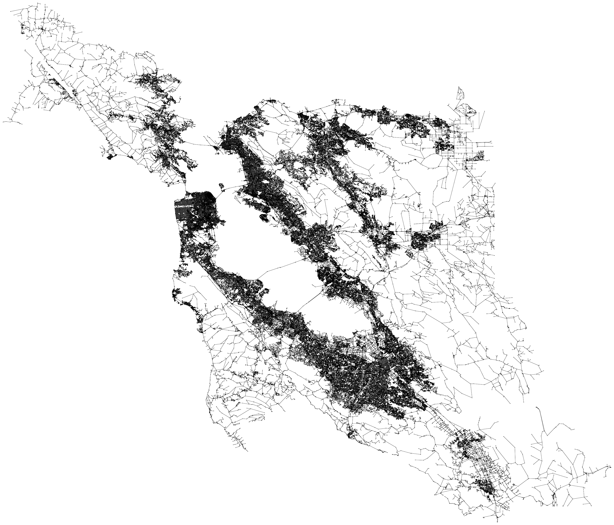

# CS225-FinalProject

<p align="center">
    <a href="#data">Data</a> - 
    <a href="#file-structure">File Structure</a> - 
    <a href="#running-instructions">Running Instructions</a> - 
    <a href="#executable">Executable</a> - 
    <a href="#ending">Ending</a>
</p>

<p align="center">
    
</p>

<div align="center">
     
    <br/>
    <a href="https://louisunlimited.com">
    
    </a>
</div>

## Data

We are using [San Francisco Road Network Data](https://www.cs.utah.edu/~lifeifei/SpatialDataset.htm) and working with the following two datasets:

- [San Francisco Road Network's Nodes](https://www.cs.utah.edu/~lifeifei/research/tpq/SF.cnode)

- [San Francisco Road Network's Edges](https://www.cs.utah.edu/~lifeifei/research/tpq/SF.cedge)

Additionally, we added [San Francisco Police Station data](https://data.sfgov.org/Public-Safety/Map-of-Police-Stations-2011-/a9xm-jdem) to our existing dataset for reference.

## File Structure

### Documents

All relevant docs can be found inside the `/docs` directory. These include dev logs, project proposal, team contract, etc.

Datasets can be found inside `/data` directory. These include all the relevant datas used in this project.

### Code base

```text
.
├── data
├── docs
├── entry
├── lib
│   ├── cs225
│   └── lodepng
├── src
└── tests
```

The main entry point to our program lies with in `main.cpp` in the `/entry` directory. We call all the functions in this file for you! 

The `/lib` directory contains all the files for producing PNG, creating pixels, and more.

```text
.
├── CMakeLists.txt
├── cs225                   /* CS225 lib */
│   ├── HSLAPixel.cpp       /* Pixel Class */
│   ├── HSLAPixel.h
│   ├── PNG.cpp             /* PNG Class */
│   ├── PNG.h
│   └── RGB_HSL.h
└── lodepng
    ├── lodepng.cpp
    └── lodepng.h
```

The `/src` directory lies the heart of our project.

```text
.
├── CMakeLists.txt
├── animation.cpp           /* GIF output */
├── animation.h             
├── coord.cpp               /* Class for Coordinates */
├── coord.h
├── filereader.cpp          /* Data Processing */
├── filereader.h
├── kdtree.cpp              /* KD Tree */
├── kdtree.h
├── mst.cpp                 /* MST w/ Prim's */
├── mst.h
├── sf_map.cpp              /* Main class for this program */
├── sf_map.h
└── sf_map_helpers.cpp      /* Extra helpers */
```

The `/test` directory contains all of our tests as well as our own dataset created for testing.

```text
.
├── large.edge.txt          /* Custom Large Dataset */
├── large.node.txt
├── medium.edge.txt         /* Custom Medium Dataset */
├── medium.node.txt
├── small.edge.txt          /* Custom Small Dataset */
├── small.node.txt
└── tests.cpp               /* Main test file */
```

Furthermore, thanks to [Github Actions](https://docs.github.com/en/actions), we are utilizing CI/CD in our project to automate the developing process. We are surprised by how our CI/CD pipelines had helped us finding potential errors that are not reported on our own dev machines. It has been a great help and a great taste of DevOps in our project. As always, the workflow file can befound in the `cmake.yml` file inside `.github` directory.

## Running Instructions

Make sure you have [docker](www.docker.com) installed on your machine and you are running this in your docker environment. If you have trouble setting up, please refer to [this](https://courses.engr.illinois.edu/cs225/fa2022/resources/own-machine/) link for reference.

Once you are in your docker environment, navigate to the root directory of this project and run the following commands to properly initalize the build directory with [cmake](https://cmake.org/):

```bash
mkdir build
cd build
cmake ..
```

## Executable

### Main

To run our wonderful tool, make sure you first run `make` then run `./main` to run our **wonderful** CLI! Follow all the instructions there and you will be all set! By default, all the outputs will be exported to the `/buil` directory in this project, but please consult the CLI for further references.

### Tests

To run all of our testcases, make sure you run `make` first! Then execute `./test_all [optinal tag]` to run all the tests we have!

We also provide extra tags for you so you don't have to run'em all in one go! Avaliable tags are:

`[FileReader]`: All data parsing tests

`[SFMap]`: SFMap constructor related tests

`[DFS]`: DFS testcases

`[Dijkstra]`: Dijkstra testcases

`[prim]`: Prim's algorithm testcase

Apart from the above ones, you can use `[png]` or `[gif]` to run all the png/gif-outputting cases.

If you have questions, please consult the gif below for reference.

<p align="center">
    
</p>

## Ending

Thank you for choosing our wonderful tool. We hope you have a great day :)

#### Made with ♡ by Daniel, Hezi, Louis, and Xiping
