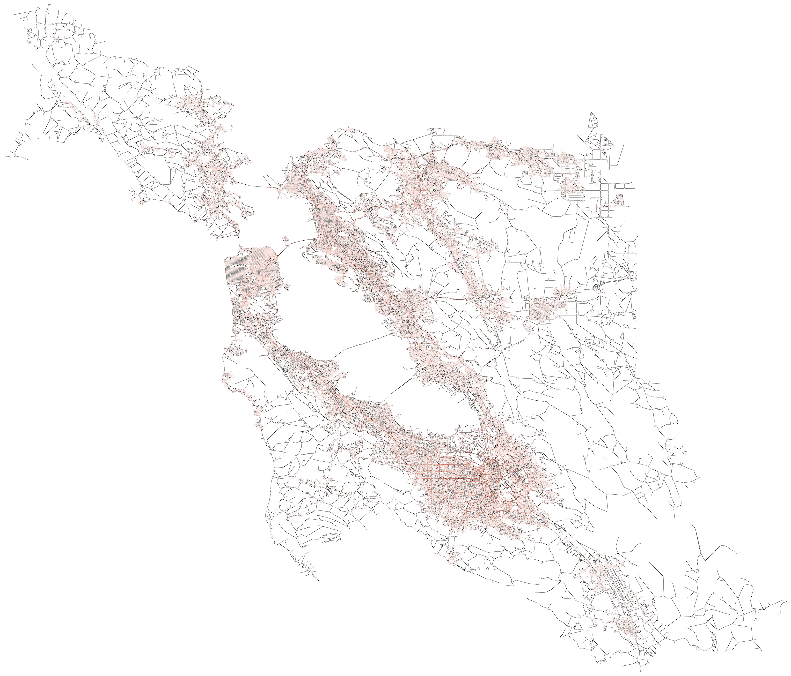

# Writtem Report

## Goal 1: Identify the importance of places in the city
  - **Algorithm**:
 
    The first goal calculates the importance of all nodes in the graph based on an estimation of the betweeness centrality. A higher betweeness centrality value indicates a more important node, as the point will more likely to be accessed by both civilians and criminals. The betweeness centrality values can be obtained by finding the multiple-source shortest path using Dijkstra's algorithm.
 
    However, applying Dijkstra's algorithm on every node will result in a runtime of around 44 hours. As a result, we introduces a threshold value such that, for each starting node, Dijkstra's algorithm will stop once it reaches a node that has a distance greater than the threshold. Using a threshold of 20 kilometers, the runtime is reduced to 4 hours at the expense of slightly inaccurate results.

    Finally, using the multiple-source shortest path, we count the frequency of each node and normalize to get the importance value. The output image will show all nodes using its importance as lightness (more important nodes are darker).

  - **Test Cases**:

    The implementation involves a helper function that returns the results of applying Dijkstra's algorithm on one starting node. In order to reduce memory usage, the helper function returns a "parent" vector, such that the ith entry represent the second last node in the shortest path from the starting node to the ith node (similar to the structure in a disjoint set). The test cases for this function focus on verifying the correctness of the parent vector. This is done by running the function on several small datasets for which the shortest paths are easy to be searched manually, and then checking the correctness of a fixed subset of indices.

  - **Output**:

    

---

## Goal 2: Emergency Contact Access Point
  - **Algorithm**:

    The second goal aims to place "emergency contact access points" (a fictional non-portable device that notifies the police when activated) at every cross and ends, and minimize the total lengths of wires connecting them. Note that the wires need to be placed along roads to avoid violation of the residents' underground spaces. Our solution is to construct a minimum spanning tree (MST) on all nodes with degree not equal to 2 (since we are only considering cross and ends) using Prim's algorithm. Nodes with degree equal to 2 will be considered as a midpoint of a longer edge.

    After the MST is constructed, it will be presented as an image showing all access points and the wires connecting them.

  - **Test Cases**:

    We run this function with a small dataset for which we can manually construct a minimum spanning tree. We then verified the result by comparing every single edge of the actual and expected output.

  - **Output**:

    

---

## Goal 3: Police Training Simulator
  - **Algorithm**:

    The third goal is to simulate the escape route of criminals using depth-first search (DFS). In most cases, the criminal does not have time to choose their path carefully, and will choose the first path they see (unless it leads to a police station). However, considering the possibility of the criminal running into a dead end, which would make the training too easy, we specify a minimum distance that the criminal have to run. Therefore, the complete implementation includes using DFS to search for a path and stop when the total length of the path exceeds the given minimum distance.

  - **Test Cases**:

    The test cases only test that the total lengths of the path must be greater than the minimum distance. The actual nodes in the path, on the other hand, is not tested, as there are multiple paths that are correct under the given restrictions.

  - **Output**:

    

---

## Goal 4: Finding the next best position for a new police station
