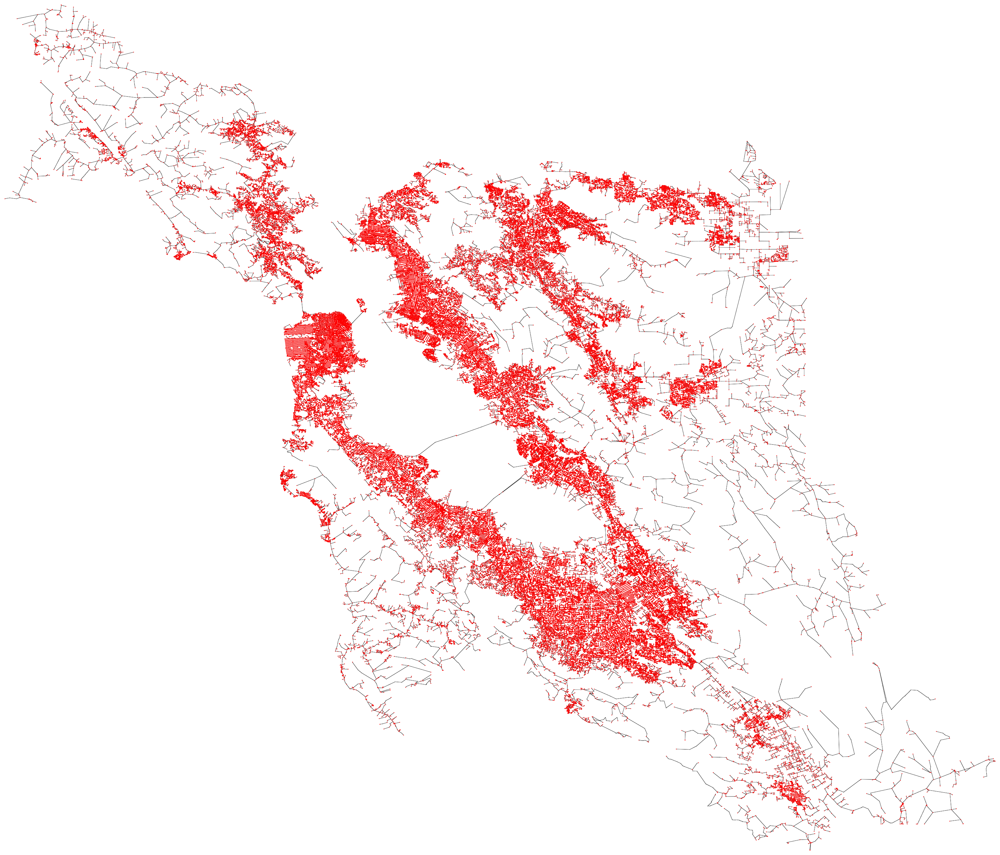

# Writtem Report

## Goal 1: Identify the importance of places in the city
  - **Algorithm**:
 
    The first goal calculates the importance of all nodes in the graph based on an estimation of the betweeness centrality. A higher betweeness centrality value indicates a more important node, as the point will more likely to be accessed by both civilians and criminals. The betweeness centrality values can be obtained by finding the multiple-source shortest path using Dijkstra's algorithm.
 
    However, applying Dijkstra's algorithm on every node will result in a runtime of around 44 hours. As a result, we introduces a threshold value such that, for each starting node, Dijkstra's algorithm will stop once it reaches a node that has a distance greater than the threshold. Using a threshold of 20 kilometers, the runtime is reduced to 4 hours at the expense of slightly inaccurate results.

    Finally, using the multiple-source shortest path, we count the frequency of each node and normalize to get the importance value. The output image will show all nodes using its importance as lightness (more important nodes are darker).

  - **Test Cases**:

    The implementation involves a helper function that returns the results of applying Dijkstra's algorithm on one starting node. In order to reduce memory usage, the helper function returns a "parent" vector, such that the ith entry represent the second last node in the shortest path from the starting node to the ith node (similar to the structure in a disjoint set). The test cases for this function focus on verifying the correctness of the parent vector. This is done by running the function on several small datasets for which the shortest paths are easy to be searched manually, and then checking the correctness of a fixed subset of indices.

  - **Output**:

    

  - **Answer to Leading Question**:

    The leading question asks for the importance of all locations in San Francisco, which is shown in the output. The image shows several lines of darker colored nodes, which correspond to important locations, surrounded by lighter colored nodes. This result suggests that areas with a dense road network only contains a few pivotal road that the police need to focus on.

    Still, this algorithm is not perfect. With a runtime of 4-6 hours, it is only capable of producing near accurate results. One solution to this issue is to apply multithreading, which would allow a more efficient usage of computing power. Heuristics can also increase the accuracy of estimations to the betweeness centrality.

---

## Goal 2: Emergency Contact Access Point
  - **Algorithm**:

    The second goal aims to place "emergency contact access points" (a fictional non-portable device that notifies the police when activated) at every cross and ends, and minimize the total lengths of wires connecting them. Note that the wires need to be placed along roads to avoid violation of the residents' underground spaces. Our solution is to construct a minimum spanning tree (MST) on all nodes with degree not equal to 2 (since we are only considering cross and ends) using Prim's algorithm. Nodes with degree equal to 2 will be considered as a midpoint of a longer edge.

    After the MST is constructed, it will be presented as an image showing all access points and the wires connecting them.

  - **Test Cases**:

    We run this function with a small dataset for which we can manually construct a minimum spanning tree. We then verified the result by comparing every single edge of the actual and expected output.

  - **Output**:

    

  - **Answer to Leading Question**:

    The above image provides the locations of the access points as well as the optimal network of wires as the answer to the leading question. Though we consider this as a successful result, there are still a few possible improvements to our algorithm. For example, access points are currently chosen solely based on the degree of the nodes, thus making it impossible to adjust the density of the access points. To solve this, we need to introduce a new node selection algorithm. In addition, while the current answer connects all access points together via one tree, it is more reasonable to connect the access points into multiple trees where each tree contains exactly one police station. In this case, the signals from the access points will be sent directly to the nearest police station on the map.

---

## Goal 3: Police Training Simulator
  - **Algorithm**:

    The third goal is to simulate the escape route of criminals using depth-first search (DFS). In most cases, the criminal does not have time to choose their path carefully, and will choose the first path they see (unless it leads to a police station). However, considering the possibility of the criminal running into a dead end, which would make the training too easy, we specify a minimum distance that the criminal have to run. Therefore, the complete implementation includes using DFS to search for a path and stop when the total length of the path exceeds the given minimum distance.

  - **Test Cases**:

    The test cases only test that the total lengths of the path must be greater than the minimum distance. The actual nodes in the path, on the other hand, is not tested, as there are multiple paths that are correct under the given restrictions.

  - **Output**:

    

  -**Answer to the Leading Question**:

    Our algorithm is able to generate an escape route for the virtual thief as presented in the GIF above. Using DFS instead of Dijkstra's algorithm guarantees that the theif does not follow the shortest path, making the escape route more realistic. The minimum distance restriction also prevents the simulation from being too short. The only drawback of this approach is the lack of randomness in the selection of the route. The same inputs always result in the same output. This can be considered during future improvements.

---

## Goal 4: Finding the next best position for a new police station
  - **Algorithm**:

    To explain the purpose of the last goal, we need to define a term called eccentricity. The eccentricity of a set of police stations is the maximum of the distance between any node in the graph and the nearest police station. If we use $V$ to represent the nodes in the graph, $P$ to represent the police stations, and $d(x, y)$ represent the length of the shortest path between nodes $x$ and $y$, then the eccentricity can be calculated with

    $$\text{ecc}(P) = \max_{v \in V}\min_{p \in P}{d(v, p)}$$

    The best new police station is defined as the new point $u$ such that, when added to the set of police stations $P$, will minimize the eccentricity:

    $$\text{best new police station} = \underset{u \in V}{\operatorname{argmin}}\ \text{ecc}(u + P) = \underset{u \in V}{\operatorname{argmin}}\ \max_{v \in V}\min_{p \in u + P}{d(v, p)}$$

    A traditional way of solving this problem would involve calculating the eccentricity (which requires applying Dijkstra's algorithm using $u + P$ as the starting nodes) for every possible values of $u$. The problem with this approach is that it would take more than 20 hours of runtime.

    Note that the inefficiency mainly comes from wasting computing power on impossible locations. For example, if the eccentricity is large because the police stations cannot effectively cover the northeastern corner, then adding police stations on the southwest will definitely fail to reduce the eccentricity. By iteratively removing impossible nodes, we reduced the runtime to merely 4 seconds.

    Eventually, the new police station and the old police station will be shown on the output map, with the former colored green and the latter colored red.

  - **Test Cases**:

    The Dijkstra's algorithm part is not tested since it is already done in goal 1. We did verify that the output location of the new police station indeed satisfy the conditions given above by using the traditional (slow) method and compare the outcomes.

  - **Output**:

    

  - **Answer to Leading Question**:

    Our function successfully answers the leading question. Testing shows that our implementation will give a reasonable location for the new police station in almost all cases. However, we did discover an interesting fact, where the optimal location is not necessarily unique under the given restrictions. Our solution will pick a random location from these possible answers.

    The direct consequence of this is that the algorithm sometimes chooses awkward locations when there are ties for the optimal. This is especially frequent when we use the same algorithm to iteratively pick multiple locations instead of just one. One possible solution to this problem is to design a tie-breaker heuristic to decide the true optimal location. The downside is this may slow down the algorithm considerably.
